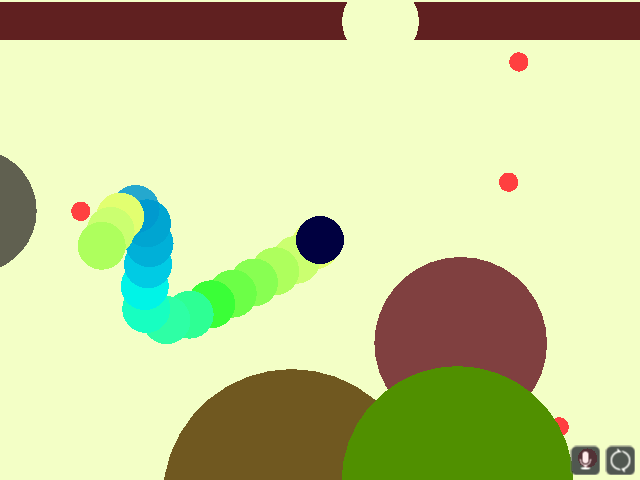

# Blind Snake
Author: Benjamin Huang

Design: Snake, except you are trying to escape the arena, eating as little as possible.

Screen Shot:

How To Play:

The objective of Blind Snake is to find the arena exit (which is a hole in the walls). There are obstacles which the snake must avoid colliding with, and also its own tail. Use the mouse to direct the snake.

Food (in red) will cause the snake to grow larger. This is undesirable when you are trying to avoid obstacles. To avoid eating food, hold the left mouse button to close your mouth. Because a snake's tongue is an important sensory organ, when the snake's mouth is closed, environmental sensing is very limited.

Moving without eating will make the snake burn carbs, which will make it thinner up to a limit. This is useful for squeezing through tight areas.

Press Spacebar to start a new game.

This game was built with [NEST](NEST.md).
